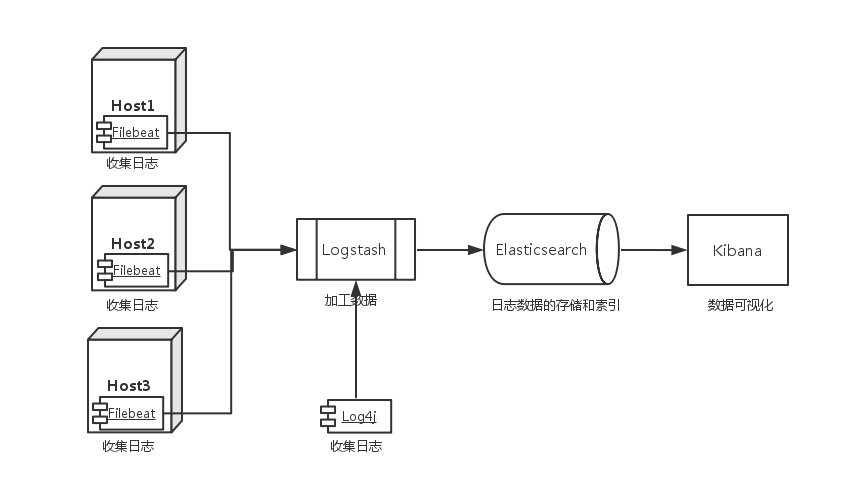

# docker-compose-elk
整体架构：



其中elk部署在同一台主机中，filebeat分布在需要采集日志的主机内

## ELK

dokcer-compose.yml:

```Yaml
version: '2'

services:

  elasticsearch:
    build: elasticsearch/
    ports:
      - "9200:9200"
      - "9300:9300"
    environment:
      ES_JAVA_OPTS: "-Xmx256m -Xms256m"
    networks:
      - elk

  logstash:
    build: logstash/
    volumes:
      - ./logstash/pipeline:/usr/share/logstash/pipeline
      - ./logstash/patterns:/opt/logstash/vendor/bundle/jruby/1.9/gems/logstash-patterns-core-4.0.2/patterns
    ports:
      - "9600:9600"
      - "5044:5044"
    environment:
      LS_JAVA_OPTS: "-Xmx256m -Xms256m"
    networks:
      - elk
    depends_on:
      - elasticsearch
    command: "-f /usr/share/logstash/pipeline/logstash-biz.conf"

  kibana:
    build: kibana/ 
    volumes:
      - ./kibana/config/:/usr/share/kibana/config
    ports:
      - "5601:5601"
    networks:
      - elk
    depends_on:
      - elasticsearch

networks:

  elk:
    driver: bridge

```

其中几个比较重要的地方：

1. 使用docker-compose的原因是volumes使用起来更加方便。
2. es和kibana的设置无需多管，按照正常的配置即可，logstash需要负责和filebeat交互，所以需要开放5044端口，再者因为使用了自定义的patterns，所以我们需要挂载一个自定义的patterns，注意command用于以指定配置文件开启logstash的方法。

## Filebeat：

docker-compose.yml:

```yaml
version: '2'
services:
  filebeat:
    build: ./ 
    container_name: filebeat 
    restart: always
    network_mode: "bridge"
    extra_hosts:
      - "logstash:10.30.54.174"
    volumes:
      - ./conf/filebeat.yml:/etc/filebeat/filebeat.yml
      - /mnt/logs/appserver/app/biz:/data/logs
      - ./registry:/etc/registry
```

这里指定输出到的logstash的地址，注意不要走公网，因为公网做了白名单控制，走内网。

其中以 `extra_hosts` 的方式，指定 Logstash 的位置；挂载配置文件目录 `conf`；挂载本机的日志目录 `/mnt/logs/appserver/app/biz`; **挂载 registry 目录，用来确定 Filebeat 读取文件的位置，防止 Filebeat 因重启或挂机导致又从头开始读取日志文件，造成日志数据重复。如果需要Filebeat从头开始读日志，把registry清空即可**

Filebeat.yml：

```yaml
filebeat:
  prospectors:
    -
      paths:
          - /data/logs/*.log
      input_type: log
      document_type: biz-log
  registry_file: ./registry/mark
output:
  logstash:
    hosts: ["logstash:5044"]
logging:
  files:
    path: /var/log/filebeat
    rotateeverybytes: 10485760 # = 10MB
```

其中prospectors配置的是需要读取日志的地址，指定input_type和document_type，其中前者一般是log，表示日志形式，后者就是你自己取的名字，output可以指定为es也可以指定为logstash，logging表示filebeat的日志输出。

更多配置与文档请见[这里](https://kibana.logstash.es/content/beats/file.html)

# 坑点

1. 启动filebeat之后出现 ERR Connecting error publishing events (retrying): dial tcp 47.93.121.126:5044: i/o timeout

   先检查网络连接，大部分原因是因为网络的关系，比如之间运维使用了白名单，然而我不知道，只要吧公网ip换成内网ip就可以了，其次，检查你的output有没有写成es了

2. 有的时候要开启多个logstash的conf文件，可以选择进到容器去开启。